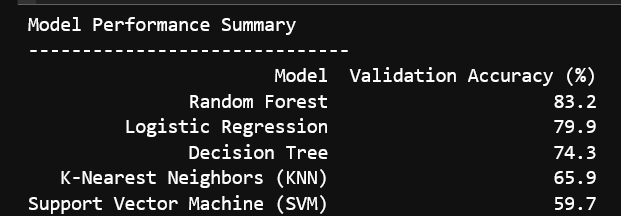
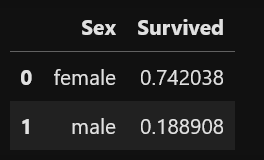
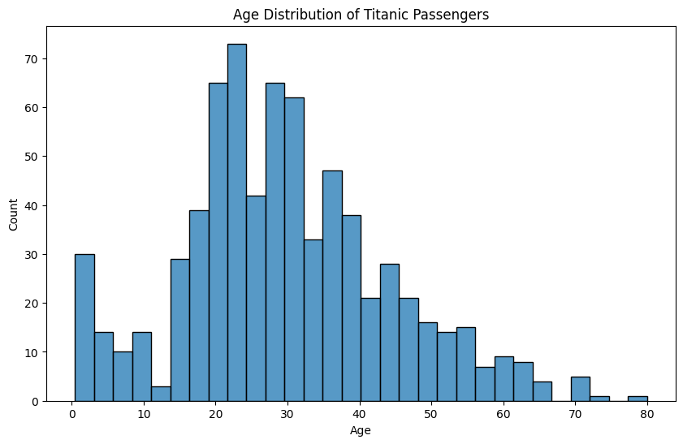
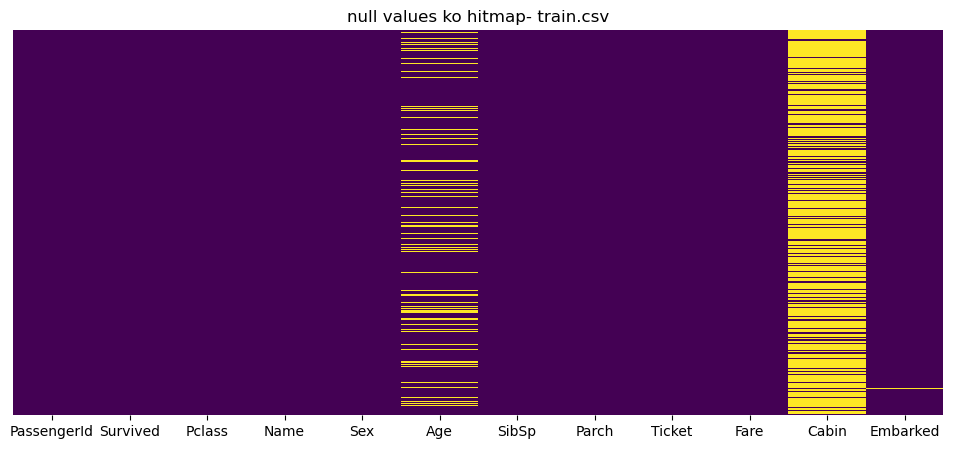
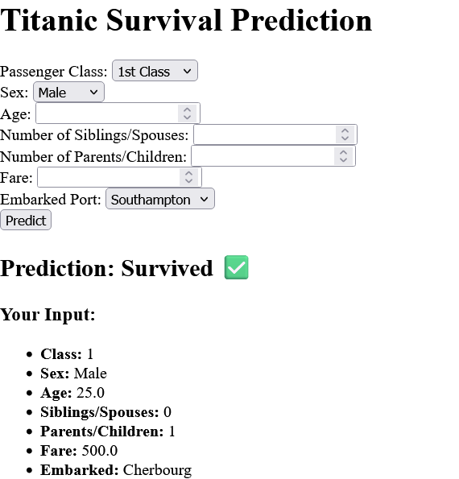

# 🚢 Titanic Survival Prediction: A Machine Learning Project

This project explores the famous Titanic dataset to predict passenger survival using a variety of machine learning models. The goal was to build a robust prediction model and analyze key features that influenced survival.

## ✨ Project Highlights

* **Data Cleaning:** Handled missing data and converted categorical features into a format suitable for modeling.
* **Model Comparison:** Trained and evaluated five different machine learning models to find the best performer.
* **Best Model:** A **Random Forest Classifier** achieved the highest accuracy, successfully predicting survival with approximately **83% accuracy**.

## 📊 Model Performance

I compared the performance of several models to determine the most effective one. The results are summarized below:

| Model                | Validation Accuracy |
|----------------------|--------------------|
| Random Forest        | ~83%               |
| Logistic Regression  | ~79%               |
| Decision Tree        | ~74%               |
| K-Nearest Neighbors  | ~66%               |
| Support Vector Machine | ~60%               |

**Visualizing the Results:**


## 📁 Project Structure

* `data/`: Contains the raw Titanic `train.csv` and `test.csv` files.
* `notebook/`: The Jupyter Notebook (`Titanic.ipynb`) with all data analysis, model training, and evaluation steps.
* `app/`: A lightweight Flask web application to make live predictions.
* `screenshots/`: A folder containing key visualizations and project results.

## 🚀 How to Run the Flask App

1.  **Navigate to the `app/` directory:**
    ```bash
    cd app
    ```
2.  **Run the Flask application:**
    ```bash
    python app.py
    ```
    Your application will be running on `http://127.0.0.1:5000/`.

## 🖼️ Key Visualizations

Here are some of the key insights and plots from the data analysis:
### Survival Rate by Gender


### Other Key Visualizations




### web app testing Visualizations
